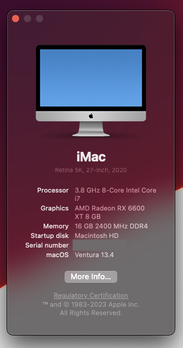

# Introduction

This repository contains the backup for my computer's OpenCore configuration.
If you're ready to dive in, buckle up, cause you already know what you're doing! Get ready to ride the waves of ~~California~~ excitement and discover what lies ahead after taking a crack at Apple's crack marketing team!

My PC specs are -

<table style="text-align: left">
  <tr>
    <th>PC Part</th>
    <th>Manufacturer</th> 
  </tr>
  <tr>
    <td>Motherboard</td>
    <td>MSI Z490 Gaming Plus</td>
  </tr>
  <tr>
    <td>CPU</td>
    <td>Intel Core i7 10700K (with UHD 630 iGPU, used for just chilling and doing nothing)</td>
  </tr>
    <tr>
    <td>GPU</td>
    <td>Sapphire AMD Radeon RX 6600XT (Navi 23, used for output and task)</td>
  </tr>
    <tr>
    <td>Sound codec</td>
    <td>Realtek ALC1200 (Onboard)</td>
  </tr>
</table>

# Installation

For installation, I used the [OpenCore bible](https://dortania.github.io/OpenCore-Install-Guide/). Thank you OpenCore developers 🙏.
To use this EFI, you have to format the USB drive as suggested in the guide and copy the EFI folder to the root of the USB drive.
You need to create a folder _com.apple.recovery_ in the **root of your USB drive** (along side EFI).
You also need to create macOS recovery disk base image (I used macrecovery.py, as I was not able to use gibMacOS). Then you need to copy the base image to _com.apple.recovery_ folder in the **root your USB drive** (along side EFI).
You might need to tweak your BIOS if needed.
Also, the UUID and serial number for the provided config.plist is redacted (for obvious reasons). You might want to use GenSMBIOS to generate new UUID and serial number. Then use ProperTree for taking a clean snapshot of your EFI folder (just in case). I strongly recommend to use -v bootarg for getting the log files and debug statements. I have disabled the logs after everything was tested.

**P.S.** **While installing macOS**, you can use this EFI folder - _EFI-Pre-Installation_, and **after the installation**, for better user experience, use this EFI folder - _EFI-Post-Installation_.
 
**P.P.S** Don't forget to copy macOS recovery files to _com.apple.recovery_ folder.
 
**P.P.P.S** Don't forget to use GenSMBIOS to generate new _UUID_ and _serial number_.

# My journey

This **_EFI was created on 25 May 2023 with latest OpenCore version 0.9.2 and latest kexts and SSDTs_**, I was not able to boot using macOS Ventura, as the mointor was going black after selecting OpenCore from bootloader (macOS Ventura is really picky, I guess?). So, I deleted the recovery image and downloaded macOS Monterey recovery image, and with the same EFI, it booted! So, if something similar happens to you, please do keep this in mind. While installing Monterey, I faced this issue, where I was not able to agree to Terms and Conditions. So, after some researching, I found that I have to skip iCloud login (don't worry, it's fine, you can do after installation). Give the installer some time. It might restart and screen might go blank for some time and, it's okay. Now, after I installed macOS Monterey, I manually updated to macOS Ventura. For playing the DRM contents, I used the [OpenCore's DRM Guide](https://dortania.github.io/OpenCore-Post-Install/universal/drm.html#testing-drm) and [WhateverGreen's DRM guide](https://github.com/acidanthera/WhateverGreen/blob/master/Manual/FAQ.Chart.md).

**I used this and it works for DRM, and I think it forces AMD GPU to use hardware decoder** - _defaults write com.apple.AppleGVA gvaForceAMDAVCDecode -boolean yes_

# Results

Everything is working. I've disabled verbose mode (-v bootarg), the bootpicker menu is beautified, the sweet macOS bootchime is music to the ears!
The Radeon GPU's temperature, Intel CPU's temperature is detected by TG Pro app, iServices like iMessage, FaceTime works. DRM contents can be played (AppleTV+, Netflix, Amazon Prime, Apple Music). The audio output to external speakers, internet works too. Adobe apps works (I've tested Photoshop and Illustrator). Apple apps like Xcode, Final Cut Pro works too without any crashes. And, the display works at 1440p@144Hz (🙈).

I've not tested WiFi and Bluetooth, as I do not have any compatible Broadcom chips sadly (but I believe that Fenvi HB1200 should work out of the box). Once, I get a compatible card, I can comment on continuity features like Handoff, Sidecar, Airdrop, Unlocking with Apple Watch etc.

### **_Dual booting macOS and Windows 10 using same bare metal, using two separate SSDs? I will take that any day over "Type 1 Hypervisor"._**

I've attached a picture for reference.

**Thank you, if you are reading this and I hope you successfully install macOS 🤞.**
